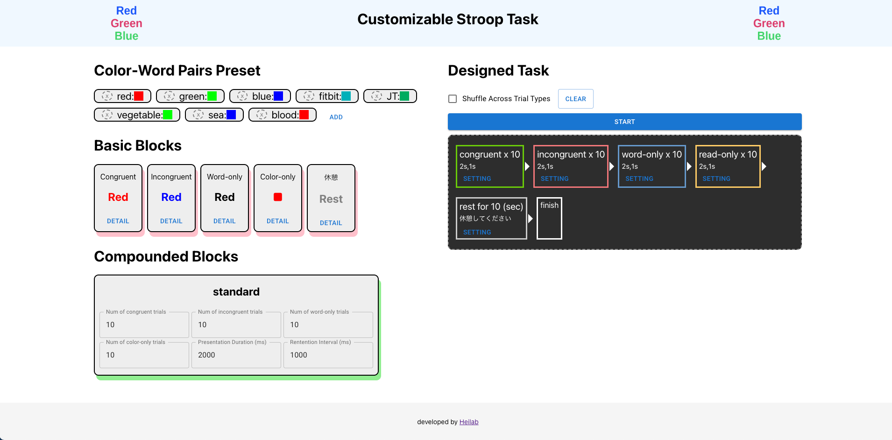

# Stroop Web Application
A web application for stroop task that experimenters can customize their own stroop task easily! 
> drag and drop basic building blocks to design a stroop task!

# For Task Designers
- Add color-word pairs to preset
- drag and drop basic blocks of trails. there are 4 types of trails as following:
    - Congurent : where presented stimuli is a word and the ink of the word is the paried color in the preset.
    - Incongurent : where presented stimuli is a word and the ink of the word is a color that do not match any pair in the preset.
    - Word-only : where presented stimuli is a word in black ink.
    - Color-only : where presented stimuli is a square in a color of any in the preset.
- Add rest block
- start the task

